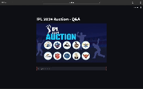
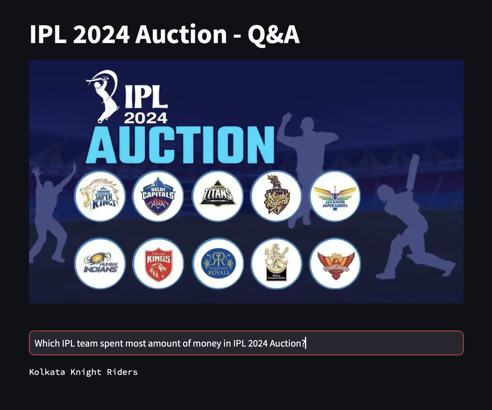

# IPL-2024-Auction-Q&ABot-RAG-LLM
This repository contains code for creating Q&Abot using RAG &amp; LLM which can answer questions regarding IPL 2024 Auctions.



### LLM Used
In this app we have used an LLM which can be run locally. For this we have made use of `Flan T-5 small` model.

### Embeddings Used
For creating document and question embeddings we have used `bge-base-en-v1.5` embedding model which can be run locally.

### How to run this code
```python
# Create virtual env
conda create -n ipl2024_rag python=3.11
conda activate ipl2024_rag

# Install necessary dependencies
pip install -r requirement_local.txt

# Run the streamlit app
streamlit run app.py

```

